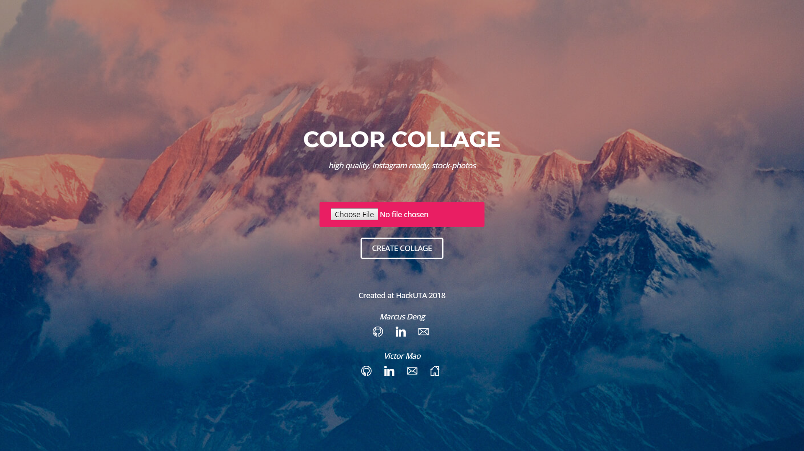
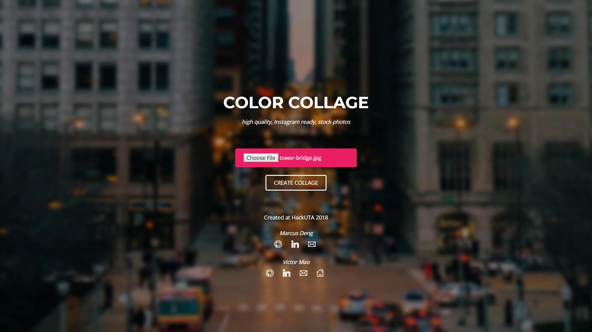
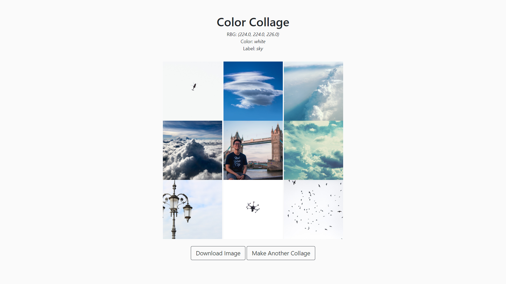

# Color Collage

Created by [Marcus Deng](https://github.com/marcusdeng22/) and [Victor Mao](https://github.com/vmao19/) at HackUTA 2018.

This web application takes an image file as input and outputs a beautiful high-quality collage built from free online stock photos. These collages are color-coordinated and thematic, based on the original photo, and can be downloaded and posted to Instagram.

## Process

An image is uploaded to the Flask web application.

The image is fed into the Google Cloud Vision API where photo themes and dominant colors are computed.

The dominant colors, which are returned as an RGB tuple, are converted to English color words using a nearest Euclidean distance algorithm.

Using the python library 'BeautifulSoup4', a python3 script scrapes [https://unsplash.com/](https://unsplash.com/) for the best 8 stock photos with the top theme and top color.

Using the python library 'pillow', the 9 images are stitched together into a colorful collage and made downloadable.

Users can choose different themes and colors to render a different collage.

## Trivia

**Programming Languages:** Python, HTML, CSS, JS

**Python Libraries:** [Flask](http://flask.pocoo.org/), [Google Cloud Vision](https://cloud.google.com/vision/), [BeautifulSoup4](https://www.crummy.com/software/BeautifulSoup/bs4/doc/), [Pillow](https://pillow.readthedocs.io/en/5.3.x/), [webcolors](https://webcolors.readthedocs.io/en/1.8.1/)

**Hours asleep:** 40 mins

**Bowls of popcorn:** 18
